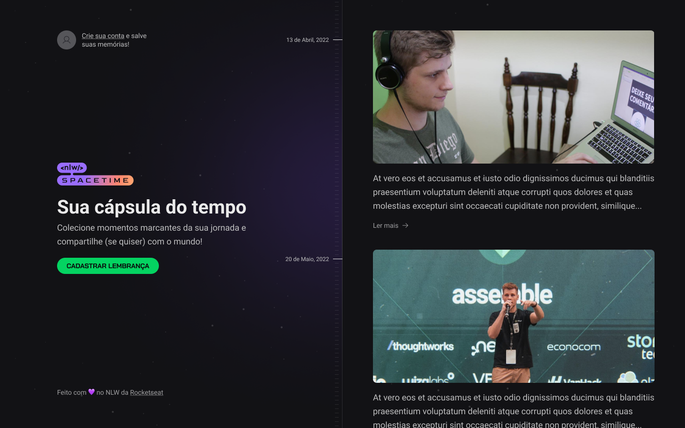

  <h1>Nlw - Spacetime🚀</h1>  
  
    
  
  

    Projeto feito na imsersão da <strong>NLW Spacetime</strong> usando as tecnologia mais atuais do mercado contruindo uma aplicação web e mobile
    integrado ao banco de dados. Nesse projeto capsula do tempo o usuário pode guarda suas memorias e recordar quando quiser.
  

  
  <h2>Tecnologias</h2>
  
   
   
   
    
  
  <h2>Comando para instalar o projeto na sua maquina</h2>
  <i>Cuidado antes separe as três partes em pasta e instale um por um.</i> 

  
        npm install

 

  
